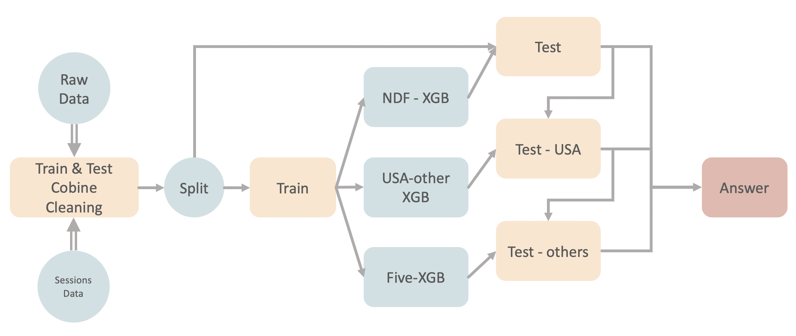
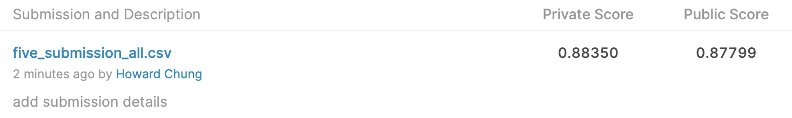
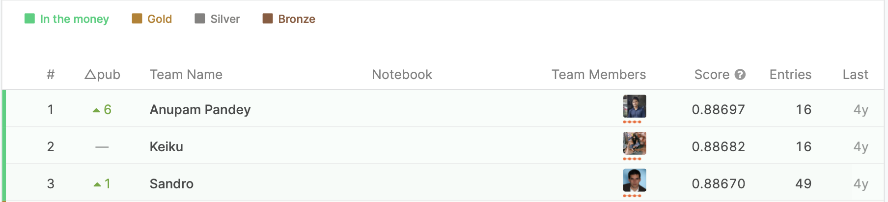

# Airbnb New Uesr Booking
* [competition-link](https://www.kaggle.com/c/airbnb-recruiting-new-user-bookings)
* [jupyter notebook](./Airbnb.ipynb) 
* [Slide](./report.pdf) 
Solution: Hierarchical XGBoosting model  
To avoid imbalanced data we followed the SVM one-against-all method provide to using binary-classification to predict the answer in hierachial way, and in the third model using the five-class XGBoost to predict the answer 

* Best score of our model!

* The private score only 0.3 percentage points from the first place！

